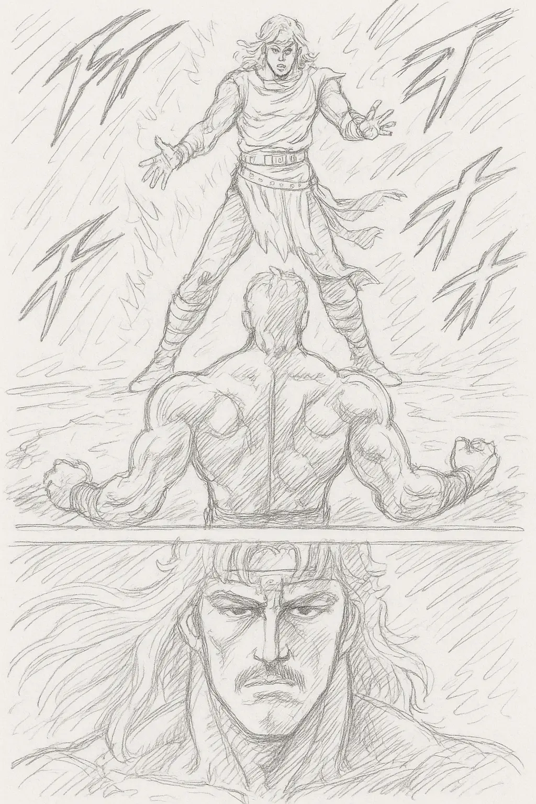

<div align="center">
    <h1>Toki</h1>
    
    <p>
      <div style="font-weight: bold;">macOSのセットアップ/カスタマイズプロジェクト</div>
      <div>誓いの時は来た！ 今 わたしは あなた(Windows)を超える！！</div>
    </p>
    <p style="font-size: 75%;">
      ※ 元ネタは<a href="https://hokuto-no-ken.jp/">北斗の拳</a>に登場するキャラクター『トキ』です
    </p>
</div>

## 概要

本リポジトリはtadashi-aikawaのWindows/Linux環境をmacOSに移行する際に作成したものです。今まで以下2プロジェクトで管理していたものから、必要なものを整理して1つにまとめました。

- [owl-playbook](https://github.com/tadashi-aikawa/owl-playbook)
- [Spinal reflex bindings template](https://github.com/tadashi-aikawa/spinal-reflex-bindings-template)

> [!WARNING]
> tadashi-aikawaの環境以外での動作は保証しません。

## セットアップ

```bash
mkdir -p ~/git/github.com/tadashi-aikawa
git clone https://github.com/tadashi-aikawa/toki
```

プロビジョニング。

```bash
./provision.sh
```

### Karabiner Elementsのファイル生成

`./karabiner/` に移動してREADMEを参照。

